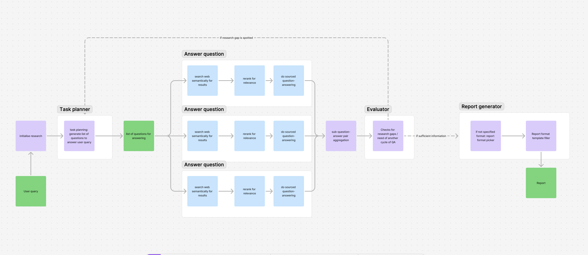

# Deep Research Tool

OpenAI's deep research tool is very good at what it does, but opensource is always better! Confurable plug and play research loops you can use to surface information in a auditable way.


## Core Features

- Autonomous research planning and execution
- Multi-cycle research capability with continuous evaluation
- Intelligent report generation in multiple formats
- Dynamic search across various domains
- Comprehensive market analysis and synthesis

## Project Structure




```
src/
├── app.py               #Binding server for inngest / fastapi app
├── config.py            # Environment variables
└── core/               
    ├── main.py          # Main research loop orchestration
    ├── clients.py       
    ├── research/        # Research execution module
    ├── search_planner/  # Research planning module
    ├── evaluation/      # Research evaluation module
    ├── report_generator/# Report generation module
    └── common/          # Shared utilities and schemas
```

### Core Components

## 1. Task Planner (`search_planner/`)

The Task Planner serves as a multi-step reasoning engine that:
- Analyzes the user query and previous research outputs
- Breaks down complex queries into core investigative questions
- Identifies key information gaps and background context needed
- Generates a structured set of research questions for the next cycle

## 2. Question Answering Workflow (`research/`)

A parallel execution pipeline that:
- Performs targeted web scraping to gather relevant context
- Uses advanced reranking to ensure granular result relevance 
- Generates detailed question-answer pairs with source attribution and dates
- Returns structured research outputs with full citation tracking

## 3. Research Evaluator (`evaluation/`)

Quality assurance system responsible for:
- Analyzing research completeness
- Identifying potential gaps or ambiguities in gathered information
- Evaluating if additional research cycles would meaningfully improve results
- Making data-driven decisions about research continuation
- Ensuring comprehensive coverage of the user's query intent

## 4. Report Generator (`report_generator/`)

Intelligent report generation system featuring:
- Format selection based on research content and query type
- Dynamic template population with research findings
- Clear linkage between conclusions and source materials

### Supported Output Formats:
- Decision support document
- Market intelligence report
- Competitive analysis
- Technical deep dive
- General information dossier

## Technology Stack

### Core Framework
- **FastAPI**: High-performance web framework for building APIs
- **Inngest**: Event-driven function orchestration for agentic workflow with ratelimiting, retries and backoff, instrumentation and more.
- **Pydantic**: Data validation using Python type annotations

### External Services

#### LiteLLM
- Unified interface for various LLM providers
- Handles API communication with different models
- Provides consistent response formatting

#### Inngest
- Event-driven function orchestration
- Manages research workflow steps
- Handles function scheduling and retries

#### Exa
- Advanced web search capabilities
- Domain-specific search filtering
- Content extraction and processing

#### Cohere
- Provides reranking capabilities
- Enhances search result relevance
- Improves content matching accuracy

## Local Development

# Credentials
First, create a `.env` file in the root directory and add your keys for the following variables:
- `ENV`
- `COHERE_API_KEY`
- `OPENAI_API_KEY`
- `ANTHROPIC_API_KEY`
- `EXA_API_KEY`


```sh
# Start Inngest dev server
npx inngest-cli@latest dev -u http://localhost:8000/api/inngest --no-discovery

# Start service
cd src && uvicorn app:app --reload
```

## Docker Deployment

```sh
# Build the application
nixpacks build . -t deep-research-app

# Run with docker-compose
docker-compose up
```

## Project Requirements

- Python 3.11+
- Docker (for containerized deployment)
- Node.js (for Inngest CLI)

## Entry point from inngest CLI: 

Navigate to localhost:8288 and you will find all of the available inngest events

Run the initialize-research inngest event with a json compatable with ReportRequest, for example:

```json
{
    "user_query": "What are the ethical implications of using CRISPR technology for genetic enhancement in humans?",
    "prior_research_cycles": [
    ],
    "report_type": None
}
```

This will kick off the research pipeline, and eventually output a report 